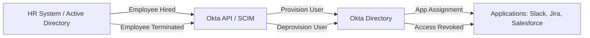

#  User Provisioning & Deprovisioning Automation in Okta

##  Project Overview

Automating **user provisioning and deprovisioning** ensures secure, efficient, and compliant identity lifecycle management. This project demonstrates how to integrate **Okta** with an HR system (or Active Directory) to:

* Automatically **create new users** in Okta.
* **Assign applications and groups** based on roles and departments.
* Automatically **deactivate and deprovision** users upon termination.
* Keep identity lifecycle events logged for **audit and compliance**.

---

##  Architecture



---

##  Key Features

* **Event-Driven Provisioning**: Triggered when a new hire record is created in HR system.
* **Attribute Mapping**: Department, Job Title, and Location mapped to Okta attributes.
* **Group-Based Access**: RBAC rules applied for app access.
* **Automated Deprovisioning**: Disabled accounts synced back from HR termination.
* **Audit Logging**: JSON logs stored for compliance.

---

##  Implementation

### 1. **Provisioning Workflow in Okta Workflows**

* **Trigger**: New employee record from HRIS or AD feed.
* **Actions**:

  * Create Okta user.
  * Assign groups based on department.
  * Provision into target apps.


---

### 2. **Deprovisioning Workflow**

* **Trigger**: HR system marks employee as terminated.
* **Actions**:

  * Suspend user in Okta.
  * Remove group assignments.
  * Deactivate from all integrated applications.


---

### 3. **Sample Okta API Script (Python)**

```python
import requests

OKTA_DOMAIN = "https://your-okta-org.okta.com"
API_TOKEN = "your_api_token"

headers = {
    "Authorization": f"SSWS {API_TOKEN}",
    "Content-Type": "application/json"
}

def create_user(first_name, last_name, email, department):
    url = f"{OKTA_DOMAIN}/api/v1/users?activate=true"
    payload = {
        "profile": {
            "firstName": first_name,
            "lastName": last_name,
            "email": email,
            "login": email,
            "department": department
        },
        "credentials": {
            "password": {"value": "TempPass@123"}
        }
    }
    response = requests.post(url, headers=headers, json=payload)
    return response.json()

# Example Usage
user = create_user("John", "Doe", "john.doe@example.com", "Engineering")
print(user)
```

---

### 4. **Provisioning Rules (RBAC Mapping Example)**

| Department  | Role      | Apps Assigned       |
| ----------- | --------- | ------------------- |
| Engineering | Developer | Jira, GitHub, Slack |
| HR          | HR Staff  | Workday, Confluence |
| Sales       | Sales Rep | Salesforce, Slack   |

---

### 5. **Deprovisioning Flow with Okta API**

```python
def deactivate_user(user_id):
    url = f"{OKTA_DOMAIN}/api/v1/users/{user_id}/lifecycle/deactivate"
    response = requests.post(url, headers=headers)
    return response.json()

# Example Usage
deactivate_user("00u1abcdEFG1234XYZ")
```

---

##  Outcomes

* **Reduced onboarding time** from days to minutes.
* **Eliminated manual errors** in provisioning.
* **Improved compliance** with automated deactivation.
* **Scalable IAM model** supporting RBAC and ABAC policies.

---

